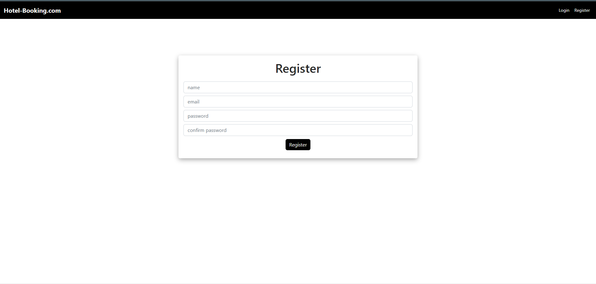

# Hotel-Booking-App

- Full-stack project for hotel room booking with ‘website’.
- App should be responsive with the portrait mode and placed horizontally when in landscape mode.
- Implemented CRUD(Create Read Update and Delete) operations on various collections such as bookings, users, etc of the database.
- Rendered rooms ‘filtered’ on the basis of its availability during selected dates, keywords, etc.
- Implemented user authentication and ACID properties in booking of room, transaction, etc.
- Different levels of access for normal users and user granted admin privileges.
- Techs Involved - NodeJS | ExpressJS | ReactJS | React Native | MongoDB | Firebase | Moment.js | Postman | Git

### Detailed Design:

- Built the app using react functional components with hooks to handle state and other life cycle methods
- App component acts as the core parent component of application, it takes care of loading the initial state, data communication and also handles how the data gets propagated to various underlying components
- Initial state of the application is set by looking up the browser storage for any pre-selected city for which the report can be fetched
- Kept the layout of the application simple to have any modification or enhancement in future to evolve the layout as required

### Front End Implementation:

- HTML
- CSS
- React

## Image UI
Following are the screenshot of the application:

### Landing Page

- This is the landing page i.e first page.

### Login Page

- This is the login page i.e first page.

### Register Page

- This is the register page i.e first page.

## How to Run the Application:

Clone the repo and setup the application

- git clone https://github.com/amankumar-2001/hotel-booking-app
- cd hotel-booking-app
- npm install
- npm start

## Application Link:

Link to the Application hosted on Vercel [LINK](https://hotel-booking-hnkaj9iio-amankumar-2001.vercel.app/)

## Author

- [@amankumar-2001](https://www.github.com/amankumar-2001)

